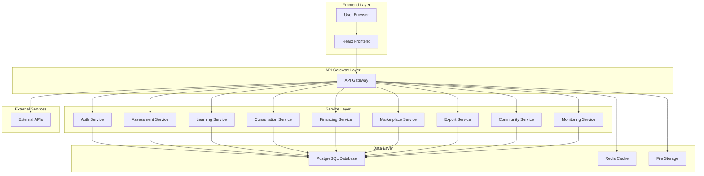

# PRD Backend - Semindo Platform

## 1. Product Overview

Backend Semindo adalah sistem pendukung platform UMKM Indonesia yang menyediakan layanan digitalisasi, pendampingan, pembiayaan, pelatihan, dan akses pasar. Sistem ini dirancang dengan arsitektur modular monolithic yang dapat diskalakan menjadi microservices.

Backend ini menjadi otak dari platform Semindo yang menghubungkan UMKM dengan berbagai layanan pendukung seperti bank, konsultan, marketplace, dan peluang ekspor internasional.

## 2. Core Features

### 2.1 User Roles

| Role | Registration Method | Core Permissions |
|------|---------------------|------------------|
| UMKM | Email/Google/Facebook Registration | Take assessment, access dashboard, enroll courses, book consultations, apply financing, manage products |
| Consultant | Admin invitation/approval | Create courses, conduct consultations, view student progress, manage schedules |
| Bank Partner | Admin verification | View financing applications, process loans, access financial data |
| Admin | Super admin creation | Full system access, user management, content moderation, system configuration |
| Partner | Business verification | Access marketplace, export services, community management |

### 2.2 Feature Module

Backend Semindo terdiri dari 9 core modules utama:

1. **Authentication Module**: User registration, login, JWT tokens, OAuth integration
2. **Assessment Module**: Self-assessment engine, scoring algorithm, PDF generation
3. **Learning Module**: Course management, progress tracking, certificate generation
4. **Consultation Module**: Booking system, video call integration, chat functionality
5. **Financing Module**: Loan simulation, risk scoring, bank API integration
6. **Marketplace Module**: Product catalog, order management, payment integration
7. **Export Module**: Export documentation, buyer matching, shipping calculator
8. **Community Module**: Forum discussions, event management, user networking
9. **Monitoring Module**: Business analytics, growth tracking, AI insights

### 2.3 Page Details

| Module Name | Feature Name | Feature description |
|-------------|--------------|---------------------|
| Authentication | User Registration | Create new user account with email verification, role assignment, and business profile setup |
| Authentication | User Login | Authenticate users with email/password or OAuth providers (Google/Facebook) |
| Authentication | JWT Token Management | Generate and validate access tokens with refresh token mechanism |
| Authentication | Password Reset | Secure password recovery via email with time-limited tokens |
| Assessment | Assessment Engine | Process 15-25 dynamic questions with real-time scoring calculation |
| Assessment | Business Level Determination | Automatically classify UMKM as Micro/Small/Medium based on scoring |
| Assessment | Recommendation Generator | Create personalized recommendations using rule-based engine |
| Assessment | PDF Report Generation | Generate comprehensive assessment reports with charts and insights |
| Learning | Course Management | Upload and organize learning materials with video, text, and quiz components |
| Learning | Progress Tracking | Monitor user learning progress with completion percentage and scores |
| Learning | Certificate Generation | Create digital certificates with digital signatures upon course completion |
| Learning | Gamification System | Award XP points and badges for learning achievements |
| Consultation | Booking System | Schedule consultations with real-time calendar availability |
| Consultation | Video Call Integration | Integrate with Zoom/Google Meet for virtual consultations |
| Consultation | Chat Functionality | Real-time messaging between UMKM and consultants |
| Consultation | Document Sharing | Upload and share business documents during consultations |
| Financing | Loan Simulation | Calculate loan eligibility and repayment schedules |
| Financing | Risk Scoring | AI-based risk assessment using business data and credit history |
| Financing | Bank Integration | Connect with partner banks via secure API endpoints |
| Financing | Application Processing | Handle loan applications with document verification |
| Marketplace | Product Catalog | Manage product listings with multi-image support |
| Marketplace | Order Management | Process orders with inventory tracking and status updates |
| Marketplace | Payment Integration | Integrate with payment gateways for secure transactions |
| Marketplace | External Marketplace Sync | Synchronize inventory with Tokopedia, Shopee, TikTok Shop |
| Export | Export Readiness Check | Assess UMKM capability for international markets |
| Export | Document Management | Handle export documents (halal, NIB, PIRT, HS Code) |
| Export | Buyer Matching | Connect UMKM with international buyers based on product categories |
| Export | Shipping Calculator | Estimate shipping costs and logistics requirements |
| Community | Forum Management | Create category-based discussion forums with moderation |
| Community | Event Management | Organize and promote webinars, workshops, and networking events |
| Community | User Networking | Facilitate connections between UMKM and business partners |
| Monitoring | Business Analytics | Track revenue, sales, and business growth metrics |
| Monitoring | Growth Tracking | Monitor digitalization progress and certification achievements |
| Monitoring | AI Data Extraction | Use OCR to extract data from receipts and financial documents |
| Monitoring | Report Generation | Create comprehensive business performance reports |

## 3. Core Process

### 3.1 UMKM Registration Flow
```
User Registration → Email Verification → Business Profile Setup → Assessment → Dashboard Access
```

### 3.2 Assessment Process Flow
```
Start Assessment → Answer Questions → Real-time Scoring → Level Determination → Recommendations → PDF Report
```

### 3.3 Learning Path Flow
```
Browse Courses → Enroll Course → Complete Modules → Take Quiz → Earn Certificate → Track Progress
```

### 3.4 Consultation Booking Flow
```
Select Consultant → Check Availability → Book Schedule → Join Video Call → Get Recommendations → Rate Experience
```

### 3.5 Financing Application Flow
```
Submit Financial Data → Risk Assessment → Loan Simulation → Select Bank → Submit Application → Track Status
```

### 3.6 Marketplace Transaction Flow
```
Upload Product → Set Price → Receive Order → Process Payment → Ship Product → Update Inventory
```

### 3.7 Export Process Flow
```
Export Readiness Check → Prepare Documents → Find Buyers → Calculate Costs → Ship Products → Track Delivery
```

### 3.8 Community Engagement Flow
```
Join Forum → Post Discussion → Get Responses → Attend Events → Network with Members → Build Reputation
```

### 3.9 Growth Monitoring Flow
```
Upload Financial Data → AI Processing → Generate Insights → Track Progress → Get Recommendations → Update Strategy
```

## 4. User Interface Design

### 4.1 Design Style
- **Primary Color**: Blue (#2563eb) - Trust and professionalism
- **Secondary Color**: Green (#10b981) - Growth and prosperity
- **Accent Color**: Orange (#f59e0b) - Energy and innovation
- **Button Style**: Rounded corners with subtle shadows
- **Font**: Inter for headings, system fonts for body text
- **Layout**: Card-based with clear visual hierarchy
- **Icons**: Modern line icons with consistent stroke width
- **Animation**: Subtle transitions and micro-interactions

### 4.2 Page Design Overview

| Module | Feature | UI Elements |
|--------|---------|-------------|
| Authentication | Login Page | Clean form with social login buttons, password visibility toggle, remember me option |
| Authentication | Registration | Multi-step form with progress indicator, real-time validation, role selection |
| Assessment | Assessment Form | Dynamic question cards with progress bar, auto-save functionality, navigation controls |
| Assessment | Results Dashboard | Score visualization with charts, recommendation cards, action buttons |
| Learning | Course Catalog | Grid layout with course cards, filtering options, search functionality |
| Learning | Course Player | Video player with transcript, progress tracking, quiz integration |
| Consultation | Booking Calendar | Interactive calendar with time slots, consultant profiles, booking confirmation |
| Consultation | Video Call | Full-screen video interface with chat sidebar, screen sharing, recording controls |
| Financing | Loan Calculator | Input forms with real-time calculation, comparison tables, application status |
| Marketplace | Product Gallery | Image carousel with zoom, product details, review system |
| Marketplace | Shopping Cart | Item management with quantity controls, price calculation, checkout process |
| Export | Document Checklist | Progress tracking with status indicators, upload functionality |
| Export | Buyer Directory | Searchable list with filtering, contact forms, matching scores |
| Community | Forum Threads | Discussion layout with voting, replies, user profiles |
| Community | Event Calendar | Monthly view with event details, registration buttons, reminders |
| Monitoring | Analytics Dashboard | Interactive charts with date ranges, export options, trend indicators |

### 4.3 Responsiveness
- **Desktop-first approach** with mobile optimization
- **Breakpoints**: 640px (mobile), 768px (tablet), 1024px (desktop)
- **Touch-friendly** interface for mobile devices
- **Progressive Web App** capabilities for offline access
- **Cross-browser compatibility** for all modern browsers

## 5. Technical Architecture

### 5.1 System Architecture


### 5.2 Technology Stack

- **Backend**: Node.js 18+ with Express.js framework
- **Database**: PostgreSQL 14+ with JSON support
- **Cache**: Redis 6+ for session and data caching
- **Authentication**: JWT with refresh tokens, OAuth2 integration
- **File Storage**: AWS S3 or local storage with CDN
- **Message Queue**: Redis Pub/Sub for real-time features
- **API Documentation**: Swagger/OpenAPI 3.0
- **Testing**: Jest for unit testing, Supertest for API testing
- **Monitoring**: Winston for logging, Prometheus for metrics

### 5.3 API Design Principles

- **RESTful architecture** with consistent naming conventions
- **JSON API specification** for request/response format
- **Pagination** for list endpoints with cursor-based approach
- **Rate limiting** to prevent abuse and ensure fair usage
- **Versioning** through URL paths (/api/v1/, /api/v2/)
- **Error handling** with standardized error response format
- **Input validation** with detailed validation error messages

### 5.4 Security Implementation

- **HTTPS enforcement** for all API endpoints
- **CORS configuration** with whitelisted origins
- **Input sanitization** to prevent SQL injection and XSS
- **Rate limiting** per user and per IP address
- **Audit logging** for all sensitive operations
- **Data encryption** for sensitive information (AES-256)
- **Password hashing** with bcrypt (12 rounds minimum)
- **Token security** with short expiration times and refresh mechanism

### 5.5 Performance Optimization

- **Database indexing** on frequently queried columns
- **Query optimization** with EXPLAIN analysis
- **Connection pooling** for database connections
- **Response caching** with appropriate cache headers
- **Lazy loading** for related data when needed
- **Batch operations** for bulk data processing
- **Background jobs** for time-consuming tasks
- **CDN integration** for static asset delivery

## 6. Integration Requirements

### 6.1 External Service Integrations

- **Payment Gateways**: Midtrans, Xendit, or similar Indonesian providers
- **Bank APIs**: Partner bank integration for loan processing
- **Video Conferencing**: Zoom API, Google Meet integration
- **Email Services**: SendGrid, Mailgun for transactional emails
- **SMS Services**: Twilio, local SMS gateway for OTP
- **Cloud Storage**: AWS S3, Google Cloud Storage for file uploads
- **Analytics**: Google Analytics, Mixpanel for user tracking
- **Monitoring**: Sentry for error tracking, New Relic for performance

### 6.2 Data Exchange Formats

- **Primary Format**: JSON with UTF-8 encoding
- **File Uploads**: Multipart/form-data for documents and images
- **Export Reports**: PDF generation with charts and tables
- **Bulk Data**: CSV import/export for mass operations
- **Real-time**: WebSocket for chat and live updates

### 6.3 API Rate Limits

- **Standard Users**: 100 requests per minute
- **Premium Users**: 500 requests per minute
- **Admin Users**: 1000 requests per minute
- **Public Endpoints**: 20 requests per minute per IP
- **File Uploads**: 10 MB per file, 50 MB per request
- **Bulk Operations**: 1000 records per batch maximum

## 7. Data Management

### 7.1 Data Retention Policy

- **User Data**: Retained until account deletion
- **Assessment Data**: 5 years for trend analysis
- **Learning Progress**: Retained with user account
- **Financial Data**: 7 years for compliance requirements
- **Chat Messages**: 1 year for consultation history
- **File Uploads**: 3 years with automatic cleanup
- **Audit Logs**: 2 years for security analysis

### 7.2 Backup Strategy

- **Database**: Daily automated backups with 30-day retention
- **File Storage**: Real-time replication across regions
- **Configuration**: Version-controlled in Git repository
- **Disaster Recovery**: 4-hour RPO, 24-hour RTO
- **Testing**: Monthly restore tests to verify backup integrity

### 7.3 Data Privacy Compliance

- **GDPR Compliance**: User data portability and right to deletion
- **Indonesian Data Protection**: Local data residency requirements
- **Financial Data**: PCI DSS compliance for payment information
- **Health Data**: HIPAA compliance where applicable
- **Children's Data**: COPPA compliance for users under 13

## 8. Monitoring and Analytics

### 8.1 System Monitoring

- **Application Performance**: Response time, error rates, throughput
- **Database Performance**: Query execution time, connection pool usage
- **Infrastructure Metrics**: CPU, memory, disk usage, network I/O
- **User Experience**: Page load time, API latency, error frequency
- **Business Metrics**: User registrations, assessment completions, course enrollments

### 8.2 Alerting System

- **Critical Alerts**: System downtime, database connection failures
- **Warning Alerts**: High response times, elevated error rates
- **Info Alerts**: Deployment completions, scheduled maintenance
- **Escalation**: Automatic escalation to on-call engineers
- **Notification Channels**: Email, Slack, SMS for critical issues

### 8.3 Reporting Dashboard

- **Real-time Metrics**: Live user activity, system health
- **Daily Reports**: User engagement, feature usage statistics
- **Weekly Reports**: Business KPIs, growth trends
- **Monthly Reports**: Comprehensive analytics, performance summary
- **Custom Reports**: Ad-hoc queries for specific business needs

## 9. Development and Deployment

### 9.1 Development Environment

- **Local Development**: Docker Compose for consistent environments
- **Code Quality**: ESLint, Prettier for code formatting
- **Testing**: Unit tests (80% coverage minimum), integration tests
- **API Testing**: Postman collections, automated API tests
- **Documentation**: Inline code documentation, API documentation

### 9.2 CI/CD Pipeline

- **Source Control**: Git with feature branch workflow
- **Build Process**: Automated builds with dependency caching
- **Testing Pipeline**: Automated unit and integration tests
- **Deployment Strategy**: Blue-green deployment for zero downtime
- **Rollback Capability**: Quick rollback to previous versions
- **Environment Management**: Development, staging, production environments

### 9.3 Version Management

- **Semantic Versioning**: Major.Minor.Patch format
- **API Versioning**: Backward compatibility for 2 versions
- **Database Migrations**: Version-controlled schema changes
- **Feature Flags**: Gradual feature rollouts and A/B testing
- **Deprecation Policy**: 6-month notice for breaking changes

## 10. Support and Maintenance

### 10.1 Support Channels

- **Technical Support**: Email support with 24-hour response time
- **Business Hours**: Monday-Friday, 9 AM - 6 PM (WIB)
- **Emergency Support**: 24/7 for critical system issues
- **Documentation**: Comprehensive API documentation and guides
- **Community Support**: Developer forum and knowledge base

### 10.2 Maintenance Schedule

- **Regular Updates**: Monthly security patches and bug fixes
- **Feature Releases**: Quarterly major feature updates
- **Database Maintenance**: Weekly optimization during low-traffic hours
- **Security Audits**: Quarterly security assessments and penetration testing
- **Performance Reviews**: Monthly performance optimization reviews

### 10.3 SLA Commitments

- **Uptime Guarantee**: 99.9% availability (43 minutes downtime per month)
- **Response Time**: API responses under 2 seconds for 95% of requests
- **Support Response**: Initial response within 4 business hours
- **Issue Resolution**: Critical issues resolved within 24 hours
- **Data Recovery**: Data recovery within 4 hours of data loss incident

This PRD Backend document serves as the comprehensive guide for developing and maintaining the Semindo platform backend infrastructure, ensuring scalability, security, and optimal performance for supporting UMKM digitalization in Indonesia.